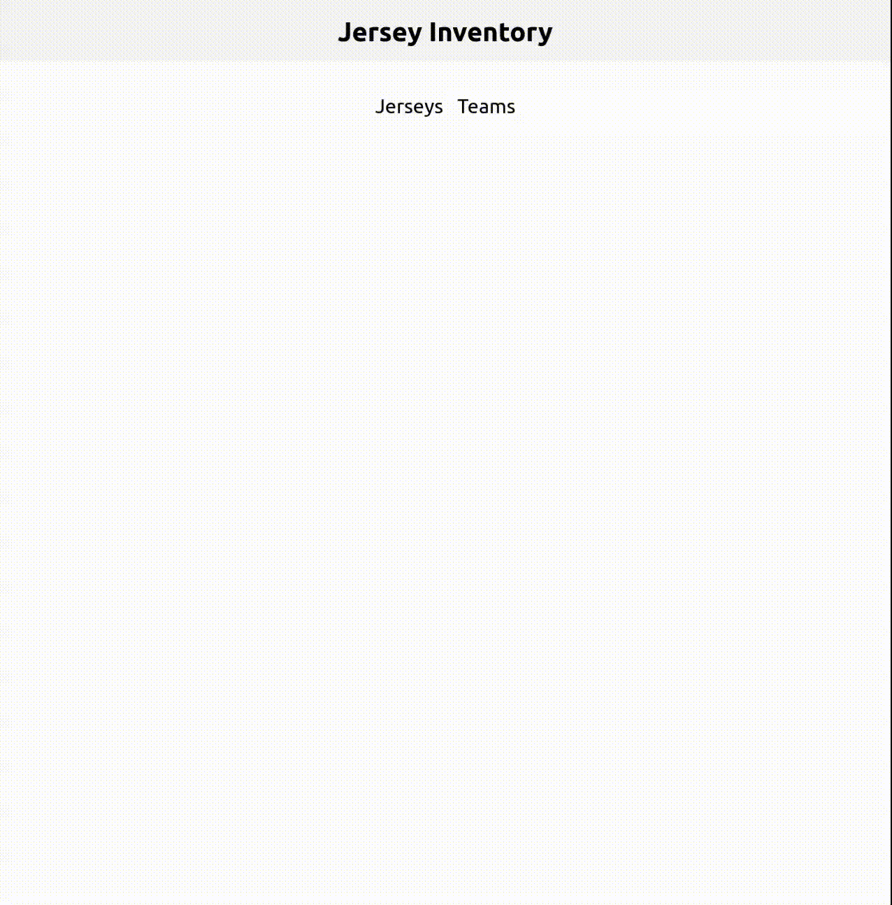

# Inventory App

This App acts as an inventory for sports jerseys. You can add new jerseys, edit, and delete. Building this site helped me practice using persistent storage with Postgresql. This site is also built using Nodejs, Express, EJS, and TypeScript.

This site is no longer deployed because I want to save my free $5 credit on Railway for other projects. However, you can find a recording of the app below:

